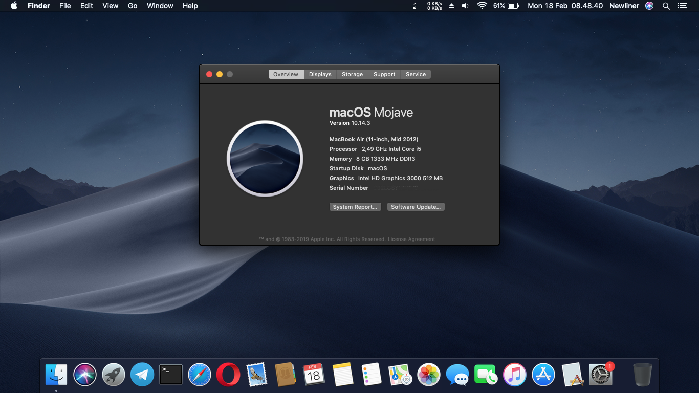
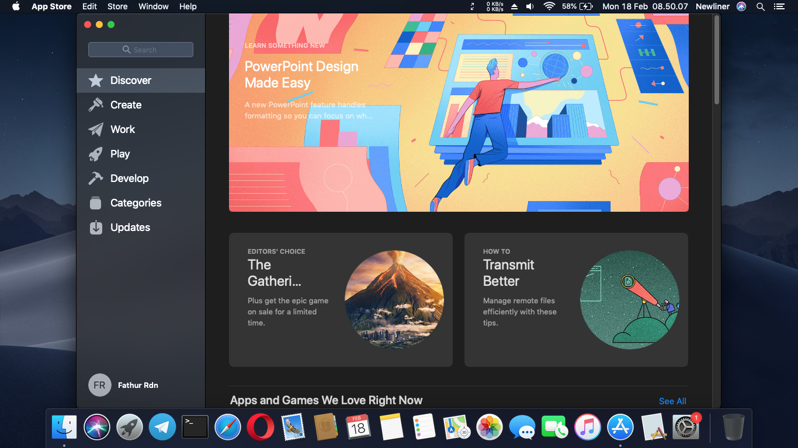
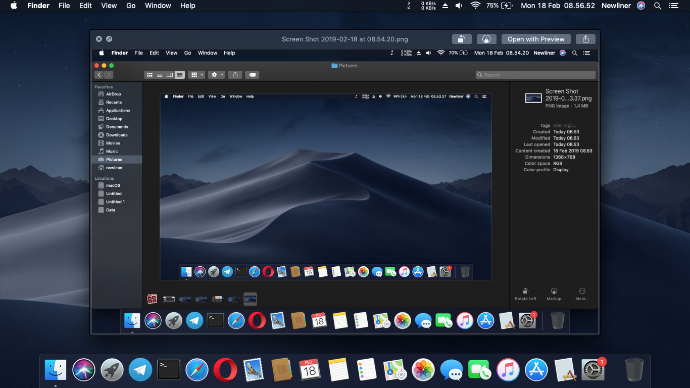
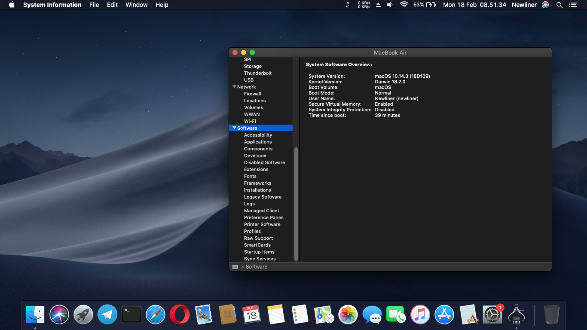

# Acer V3-471G

This is my backup clover config and kext that I use for macOS Mojave build 18D109 on Acer V3-471G. I do not yet understand about dsdt and ssdt patching, so I think it still needs more patch further, but for my daily use now I think it's enough.

### Audio
- The model of the sound card is `Realtek ALC269`, which is driven by `AppleALC` on layout-id 1 (Testing | speaker : no sound, headphone : good); injection information is located in `/CLOVER/config.plist`.
    
### Bluetooth
- Native Bluetooth is [not working well], disabled.

### CPU
- The model is `i5-2450M` 2.5 GHz. In my old device temp is high 70-85 (sad). Maybe I try to replace my thermal paste.

### Graphics
- The model name is `Intel HD3000`, renamed GFX0 -> IGPU in /CLOVER/config.plist.
- The discrete graphics' name is `NVIDIA GeForce GT 630M`, disabled by `-wegnoegpu` because macOS doesn't support Optimus technology.
- Native brightness support.
- External vga and hdmi not tested yet

### Keyboard
- Normal with `VoodooPS2Controller`

### HDD
- My device use 2x 500GB HDD work correctly. replaced cdrom with HDD more useful for me.

### Touchpad
- Normal with `VoodooPS2Controller`

### Wi-Fi
- The wireless model is `Atheros AR9462`. Enabled by `ATH9KInjector` and `ATH9KFixup`

### Feature
- Mac App Store, iMessage fix, change SMBIOS from MacBookPro8,1 -> MacBookAir5,1 [Ref](https://www.tonymacx86.com/threads/readme-common-problems-and-workarounds-on-10-14-mojave.255823/)

## Installation

### Clover
- copy really need kext in CLOVER/kext/other
- copy config.plist and generate new serial number to [fix iMessege](https://www.tonymacx86.com/threads/an-idiots-guide-to-imessage.196827/)

### L/E
for installing 3rd party kext, I use [this guide](https://www.tonymacx86.com/threads/guide-installing-3rd-party-kexts-el-capitan-sierra-high-sierra-mojave.268964/). 

Open Terminal.app, move to path you clone/download master

```bash
cd /move/to/path
```

copy all kext in path before, and enter your password

```bash
sudo cp -R *.kext /Library/Extensions
```

rebuild kext cache

```bash
sudo kextcache -i /
```

### S/L/E
for install to System/Library/Extensions, I use kext installer like kextwizard

## Screenshot

<details><summary>Screenshot</summary>
<p>






</p>
</details>

## Credits

- [Apple](https://www.apple.com) for macOS 

- Thanks to [Acidanthera](https://github.com/acidanthera) for providing [AppleALC](https://github.com/acidanthera/AppleALC), [Lilu](https://github.com/acidanthera/Lilu), and [WhateverGreen](https://github.com/acidanthera/WhateverGreen).

- Thanks to [apianti](https://sourceforge.net/u/apianti), [blackosx](https://sourceforge.net/u/blackosx), [blusseau](https://sourceforge.net/u/blusseau), [dmazar](https://sourceforge.net/u/dmazar), and [slice2009](https://sourceforge.net/u/slice2009) for providing [Clover](https://sourceforge.net/projects/cloverefiboot).

- Thanks to [chunnann](https://github.com/chunnann) and [black-dragon74](https://github.com/black-dragon74) for providing [ATH9KFixup](https://github.com/black-dragon74/ATH9KFixup).

- Thanks to [RehabMan](https://github.com/RehabMan) for providing [ACPIBatteryManager](https://github.com/RehabMan/OS-X-ACPI-Battery-Driver), [OS-X-Clover-Laptop-Config](https://github.com/RehabMan/OS-X-Clover-Laptop-Config), [Realtek RTL8111 Network Driver](https://github.com/RehabMan/OS-X-Realtek-Network), and [VoodooPS2Controller](https://github.com/RehabMan/OS-X-Voodoo-PS2-Controller).
